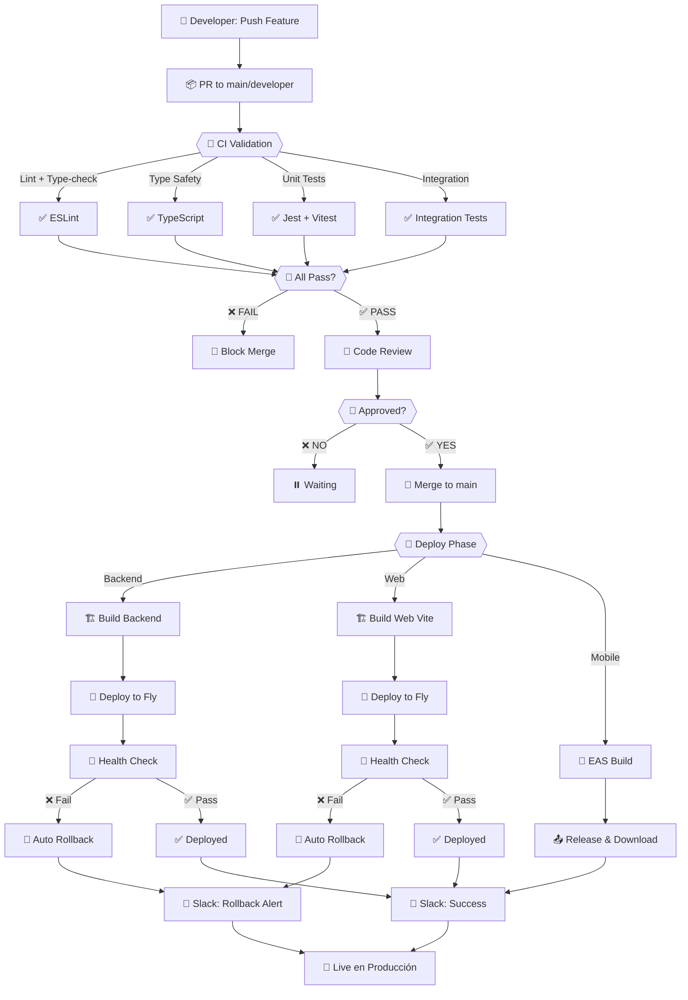

# CI/CD Pipeline - Documentación Completa

**UniConnect Project** | Backend, Frontend (Web) & Mobile (App)  
**Última actualización**: Mayo 2026

---

## 📋 Contenido

- [Resumen General](#resumen-general)
- [Diagrama del Flujo](#diagrama-del-flujo)
- [Secretos Requeridos](#secretos-requeridos)
- [Entornos Disponibles](#entornos-disponibles)
- [Workflows Detallados](#workflows-detallados)
- [Procedimientos Operacionales](#procedimientos-operacionales)

---

## 🎯 Resumen General

El pipeline CI/CD de **UniConnect** automatiza completamente el ciclo de vida de las aplicaciones:

- **3 repositorios**: Backend, Frontend Web, Mobile App (en monorepo)
- **5 workflows principales**: CI, CD (Backend), CD (Frontend), EAS Build, Validaciones
- **Entornos**: Desarrollo, Staging (opcional), Producción (Fly.io)
- **Protecciones**: Status checks en main, rollback automático, alertas Slack

### Flujo de Deployments

```
Feature Branch
    ↓
Pull Request → CI Validation
    ↓
Code Review + Tests Pass
    ↓
Merge to main
    ↓
Parallel Deployments:
├─ Backend → Fly.io (+ Rollback)
├─ Web → Fly.io (+ Rollback)
└─ Mobile → EAS Build → Release
    ↓
Slack Notification
```

---

## 📊 Diagrama del Flujo



---

## 🔐 Secretos Requeridos

Todos los secretos deben configurarse en:
**GitHub → Settings → Secrets and variables → Actions**

### Backend Repository

| Secret | Descripción | Valor de Ejemplo | Obtener en |
|--------|-----------|-----------------|-----------|
| `FLY_API_TOKEN` | Token de autenticación Fly.io | `FlyV1 xxxx...` | https://fly.io/user/personal_access_tokens |
| `SLACK_WEBHOOK_URL` | URL de webhook Slack para alertas | `https://hooks.slack.com/services/...` | Slack → Apps → Incoming Webhooks |

### Frontend (Web) Repository

| Secret | Descripción | Valor de Ejemplo | Obtener en |
|--------|-----------|-----------------|-----------|
| `FLY_API_TOKEN` | Token de autenticación Fly.io | `FlyV1 xxxx...` | https://fly.io/user/personal_access_tokens |
| `SLACK_WEBHOOK_URL` | URL de webhook Slack para alertas | `https://hooks.slack.com/services/...` | Slack → Apps → Incoming Webhooks |

### Mobile (App) Repository

| Secret | Descripción | Valor de Ejemplo | Obtener en |
|--------|-----------|-----------------|-----------|
| `EXPO_TOKEN` | Token de autenticación Expo | `expo_xxxxxxxxxx` | https://expo.dev/accounts/profile/personal-access-tokens |
| `SLACK_WEBHOOK_URL` | URL de webhook Slack (opcional) | `https://hooks.slack.com/services/...` | Slack → Apps → Incoming Webhooks |

---

## 🌍 Entornos Disponibles

### Backend

| Entorno | URL | Region | BD | Auto-Deploy | Rollback |
|---------|-----|--------|----|-----------|----|
| **Producción** | `https://uniconnect-backend.fly.dev` | `gru` (Brasil) | MongoDB Atlas | ✅ (main) | ✅ |

**Variables de Entorno** (en `.env`):
- `DATABASE_URL` → MongoDB connection
- `JWT_SECRET` → Signing key
- `GOOGLE_CLIENT_ID` → OAuth
- `AUTH0_DOMAIN` → Auth0 config

### Frontend Web

| Entorno | URL | Region | Servidor | Auto-Deploy | Rollback |
|---------|-----|--------|----------|----------|----|
| **Producción** | `https://uniconnect-frontend.fly.dev` | `gru` (Brasil) | Nginx | ✅ (main) | ✅ |

**Build Args** (en `fly.toml`):
```
EXPO_PUBLIC_API_URL = "https://uniconnect-backend.fly.dev"
EXPO_PUBLIC_ALLOWED_DOMAIN = "ucaldas.edu.co"
EXPO_PUBLIC_AUTH0_CONNECTION = "google-oauth2"
```

### Mobile App (Expo)

| Entorno | Profile | Build Para | Download | Auto-Deploy |
|---------|---------|----------|----------|----------|
| **Preview** | `preview` | iOS + Android | GitHub Releases | ✅ (main) |
| **Production** | `production` | iOS + Android | App Store + Play Store | 🔧 Manual |

**EAS Build Output**:
- Preview builds → GitHub Releases con enlace de descarga
- QR code para escanear y instalar directamente en dispositivo

---

## 🔄 Workflows Detallados

### 1️⃣ **CI - Tests & Build** (`ci.yml`)

**Trigger**: Push + Pull Request a `main`/`developer`

**Etapas**:

```yaml
Lint & Type Check (paralelo):
├─ ESLint (Web)
├─ TypeScript --noEmit
└─ API types build

Build & Test (depende de anterior):
├─ npm run test:all (con coverage)
├─ Vite build (web)
├─ Upload coverage a CodeCov
└─ ❌ BLOQUEA MERGE si alguno falla
```

**Status Checks (deben estar habilitados en branch protection)**:
- ✅ `CI - Tests & Build / Lint & Type Check`
- ✅ `CI - Tests & Build / Build & Test`

---

### 2️⃣ **CD - Deploy Backend** (`fly-deploy.yml`)

**Trigger**: Push a `main` DESPUÉS de CI exitoso

**Etapas**:

```yaml
Build & Deploy:
├─ npm ci + npm run build
├─ Tests pre-deploy (npm test)
└─ flyctl deploy --remote-only

Post-Deploy Verification:
├─ Health check (GET /health)
└─ Status de Fly.io

❌ Si falla:
├─ 🔄 Rollback automático
├─ 💬 Notificación Slack
└─ 🔗 Link a logs de GitHub
```

**Rollback Features**:
- Detecta versión anterior automáticamente
- Ejecuta `flyctl releases rollback <release_id>`
- Verifica salud post-rollback

**Slack Alerts**:
- ✅ Success: "Backend Deployment Successful"
- ❌ Failure: "Backend Deployment FAILED & Rolled Back"

---

### 3️⃣ **CD - Deploy Frontend Web** (`fly-deploy.yml`)

**Trigger**: Push a `main` CON cambios en `web/**`

**Etapas**:

```yaml
Build:
├─ npm ci
├─ Build API types
└─ Vite build

Deploy:
├─ flyctl deploy (con build args)
├─ Health check (GET /)
└─ Verify Nginx serving

❌ Si falla → Auto Rollback + Slack Alert
```

**Build Args Passed**:
```
EXPO_PUBLIC_API_URL="https://uniconnect-backend.fly.dev"
EXPO_PUBLIC_ALLOWED_DOMAIN="ucaldas.edu.co"
EXPO_PUBLIC_AUTH0_CONNECTION="google-oauth2"
```

---

### 4️⃣ **EAS Build Mobile** (`eas-build.yml`)

**Trigger**: Push a `main` CON cambios en `app/**`

**Etapas**:

```yaml
Setup:
├─ Checkout + npm ci
├─ Setup EAS CLI
└─ Autenticación con EXPO_TOKEN

Build:
├─ eas build --platform all --profile preview
└─ Espera completación en EAS servers

Release Creation:
├─ Captura build URL
├─ Crea GitHub Release
└─ Registra links de descarga
```

**GitHub Release Content**:
```markdown
## 📱 Mobile App Preview Build

Build ID: `eas_build_xxxx`
Platform: iOS & Android
Profile: Preview

Download Links:
- iOS: [QR / Direct Link]
- Android: [APK Link]

Commit: [link]
Triggered by: @github_user
```

---

### 5️⃣ **PR - Coverage Report** (`pr-coverage.yml`)

**Trigger**: Pull Request a `main`/`developer`

**Etapas**:

```yaml
Execution:
├─ npm test -- --coverage
├─ Parse coverage-summary.json
└─ Compara vs threshold (75-80%)

Comment:
├─ Crea/actualiza comentario en PR
├─ Tabla: Statements | Branches | Functions | Lines
└─ ✅/❌ por métrica

Bloqueador:
└─ Si Statements < threshold → exit 1 (bloquea merge)
```

**Ejemplo de Comentario**:

```
## 📊 Code Coverage Report

✅ Coverage Status: Above threshold

| Metric | Coverage | Status |
|--------|----------|--------|
| Statements | 87.42% | ✅ |
| Branches | 81.05% | ✅ |
| Functions | 92.30% | ✅ |
| Lines | 88.15% | ✅ |

Threshold: 80%
```

---

### 6️⃣ **PR - Validation & Checks** (`pr-validation.yml`)

**Trigger**: PR opened/reopened/synchronized

**Validaciones**:

```yaml
Lint Commit Messages:
├─ Format: type(scope): description
├─ Examples: feat(auth), fix(api), docs
└─ ✅ Requerido para merge

Validate PR:
├─ Title format check
├─ Description no vacía
├─ Detección de conflictos merge
└─ Size label (XS/S/M/L/XL)
```

---

### 7️⃣ **Security & Quality** (`security-quality.yml`)

**Trigger**: Push + PR + Semanal (domingos 2am UTC)

**Análisis**:

```yaml
npm audit --audit-level=moderate
├─ Vulnerabilidades críticas/altas
└─ Sugiere npm audit fix

Dependency Check:
├─ npm outdated
└─ Reporte de updates disponibles

Code Quality:
├─ TypeScript compilation
└─ Validar estructura proyecto
```

---

## 📋 Procedimientos Operacionales

### Configurar Secretos en GitHub

1. **Ir a Settings**:
   ```
   GitHub Repo → Settings → Secrets and variables → Actions
   ```

2. **Agregar secretos** (click "New repository secret"):

   **Backend**:
   ```
   Name: FLY_API_TOKEN
   Value: [tu token de fly.io]
   
   Name: SLACK_WEBHOOK_URL
   Value: [tu webhook URL]
   ```

   **Frontend Web**:
   ```
   Name: FLY_API_TOKEN
   Value: [tu token de fly.io]
   
   Name: SLACK_WEBHOOK_URL
   Value: [tu webhook URL]
   ```

   **Mobile App**:
   ```
   Name: EXPO_TOKEN
   Value: [tu token de Expo]
   ```

### Obtener Tokens

**Fly.io**:
1. https://fly.io/user/personal_access_tokens
2. Click "Create token"
3. Copiar token (empieza con `FlyV1`)

**Slack Webhook**:
1. Ir a tu Slack workspace
2. Apps → Custom Integrations → Incoming Webhooks
3. Create New
4. Copiar URL completa

**Expo Token**:
1. https://expo.dev/accounts/profile/personal-access-tokens
2. Create
3. Copiar token

### Configurar Branch Protection

**Para rama `main`**:

1. **Settings → Branches → Add Rule**
2. **Branch name pattern**: `main`
3. **Requerimientos**:
   - ✅ Require pull request reviews (1 approval)
   - ✅ Require status checks to pass:
     - `CI - Tests & Build / Lint & Type Check`
     - `CI - Tests & Build / Build & Test`
     - `PR - Coverage Report`
     - `PR - Validation & Checks / PR Validation`
   - ✅ Require branches to be up to date
   - ✅ Require conversations resolved

4. **Administración**:
   - Quien puede hacer push: Admins solo

---

## 🧪 Simulación Local

### Simular CI localmente

```bash
# Backend
cd uniconnect-backend
npm ci
npx prisma generate
npx tsc --noEmit
npm run build
npm test -- --coverage

# Frontend Web
cd Frontend-UnConnect/web
npm ci
npm run lint
npx tsc --noEmit
npm run build
npm test -- --coverage

# Frontend Mobile
cd Frontend-UnConnect/app
npm ci
npx tsc --noEmit || true
npm test -- --coverage
```

### Simular deploy (dry-run)

```bash
# Backend
flyctl deploy --dry-run

# Frontend
cd Frontend-UnConnect
flyctl deploy --dry-run
```

---

## 🆘 Troubleshooting

### Deploy falla pero tests pasan localmente

1. **Revisar logs**:
   ```bash
   GitHub Actions → [workflow] → [job] → [step logs]
   ```

2. **Verificar variables de entorno**:
   - ¿Están todos los secretos configurados?
   - ¿Están sus valores correctos?

3. **Test en environment similar**:
   ```bash
   NODE_ENV=production npm run build
   NODE_ENV=test npm test
   ```

### Rollback no funciona

1. **Verificar releases recientes**:
   ```bash
   flyctl releases
   ```

2. **Rollback manual si es necesario**:
   ```bash
   flyctl releases rollback <release_id>
   ```

3. **Verificar salud**:
   ```bash
   flyctl logs
   flyctl status
   ```

### Slack notifications no llegan

1. **Verificar webhook URL**:
   ```bash
   curl -X POST -H 'Content-type: application/json' \
     --data '{"text":"Test"}' \
     $SLACK_WEBHOOK_URL
   ```

2. **Verificar permisos del channel**:
   - ¿El webhook tiene acceso al channel?
   - ¿El workspace permite webhooks entrantes?

---

## 📊 Métricas y Monitoreo

### Ver Workflows

- **Dashboard**: GitHub Repo → Actions
- **Filtrar por status**: Success, Failure, Cancelled
- **Ver logs**: Click en workflow → Job → Step

### Badges de Status

Agregar a README:

```markdown
[](https://github.com/[owner]/[repo]/actions/workflows/ci.yml)

[](https://github.com/[owner]/[repo]/actions/workflows/fly-deploy.yml)

[](https://github.com/[owner]/uniconnect-frontend/actions/workflows/fly-deploy.yml)
```

---

## 🚀 Próximas Mejoras (Roadmap)

- [ ] Notificaciones a Microsoft Teams (además de Slack)
- [ ] Canary deployments (desplegar a % de tráfico)
- [ ] Staging environment pre-producción
- [ ] Database migrations automáticas pre-deploy
- [ ] Performance benchmarks en CI
- [ ] Security scanning (OWASP ZAP)
- [ ] Load testing pre-producción

---

## 📞 Soporte

**Para issues con CI/CD**:

1. Revisar este documento
2. Checklist en [CI_CD_TROUBLESHOOTING.md](../CI_CD_TROUBLESHOOTING.md)
3. Logs en GitHub Actions
4. Contactar al equipo DevOps

**Documentación externa**:
- [Fly.io Deployments](https://fly.io/docs/app-guides/continuous-deployment-with-github-actions/)
- [GitHub Actions](https://docs.github.com/actions)
- [EAS Build](https://docs.expo.dev/build/)
- [Slack API](https://api.slack.com/)

---

**Última revisión**: Mayo 2026  
**Responsable**: DevOps Team  
**Versión**: 2.0 (Rollback + Alertas + EAS Build)
