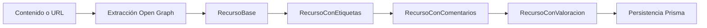

# Arquitectura de Recursos y Decorators

## Objetivo

El módulo de recursos usa el patrón Decorator para enriquecer la metadata sin romper la estructura base del recurso ni mezclar responsabilidades con notificaciones o mensajes.

## Capas

### 1. Componente base

- `RecursoBase` guarda `titulo`, `contenido` y metadata base.
- Expone la interfaz común `RecursoComponent`.

### 2. Decoradores de recursos

- `RecursoConEtiquetas`: concatena etiquetas a la metadata.
- `RecursoConComentarios`: concatena comentarios sin sobrescribir los anteriores.
- `RecursoConValoracion`: agrega acumulado, total de votos y promedio.

### 3. Servicio de recursos

- `RecursoService.crearRecurso()` detecta URLs, intenta extraer Open Graph y construye el recurso con `RecursoBase`.
- `editarRecurso()` valida permisos y, si cambia el contenido, vuelve a resolver metadata Open Graph.
- `eliminarRecurso()` sólo permite eliminar al creador o al administrador del grupo.

## Flujo de composición

## Compatibilidad con decoradores de mensajes

- Los decoradores de recursos y notificaciones comparten la misma idea de composición, pero no comparten estado ni contratos concretos.
- `NotificacionBase` + `NotificacionDecorator` forman una cadena separada para `render()`.
- Esto permite usar ambos sistemas en el mismo flujo sin mezclar metadata de recursos con campos de notificación.

## Endpoints

### Recursos

- `POST /api/recursos`: crea un recurso protegido por JWT.
- `GET /api/recursos/grupo/:grupoId`: lista recursos del grupo.
- `PUT /api/recursos/:id`: edita un recurso si el usuario es creador o administrador.
- `DELETE /api/recursos/:id`: elimina un recurso si el usuario es creador o administrador.

## Filtros de recursos

La clasificación visual de recursos se apoya en `detectResourceType()`:

- `video`
- `pdf`
- `repo`
- `doc`
- `image`
- `ai`
- `link`

La interfaz móvil usa estos tipos para sus chips de filtro y para decidir el estilo visual de cada tarjeta.
