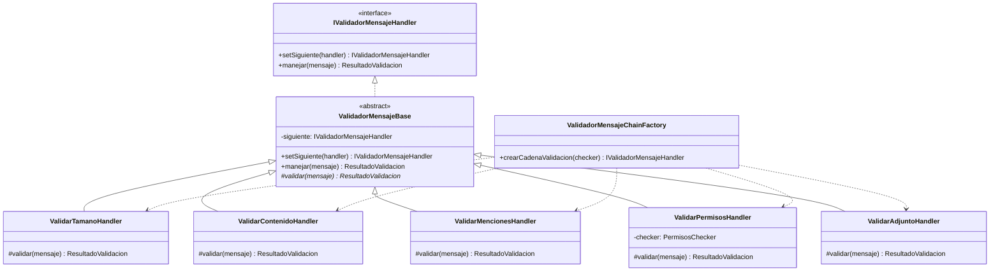
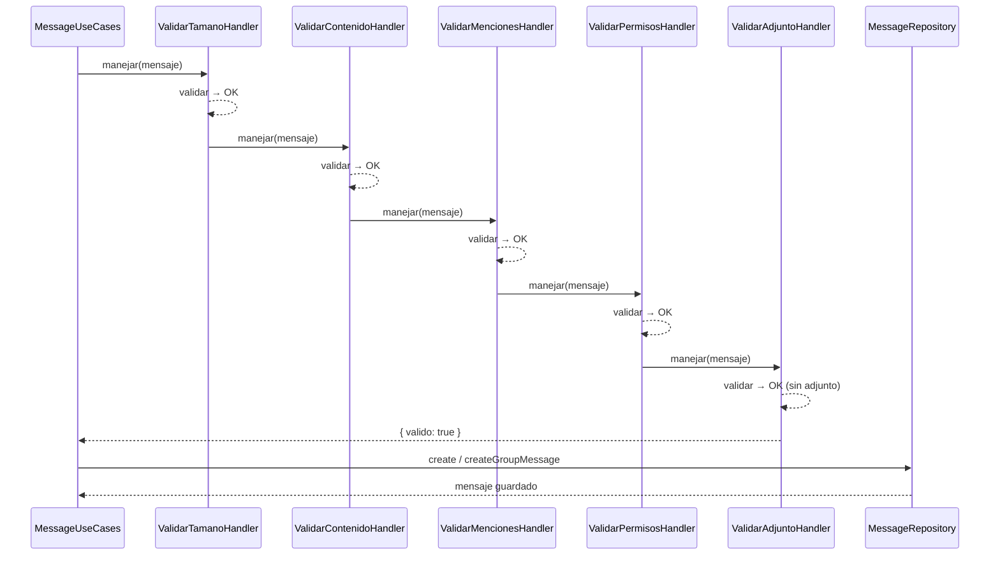
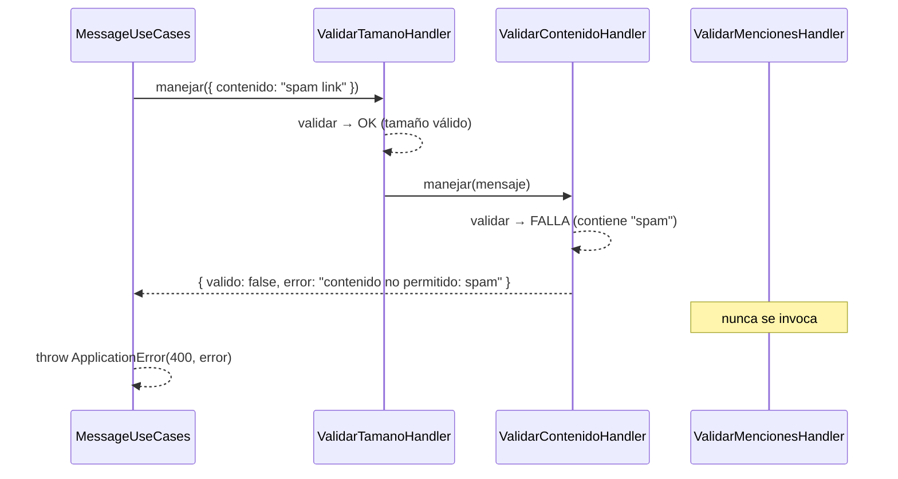

# Módulo de Mensajes — Chain of Responsibility

## Patrón Chain of Responsibility para validación de mensajes

Cada validación es un handler independiente. La cadena se construye en un único punto
(`ValidadorMensajeChainFactory`) y puede extenderse sin modificar los handlers existentes.

---

## Diagrama UML de clases



---

## Diagrama de secuencia — Caso exitoso

Mensaje que pasa todas las validaciones y se persiste.



---

## Diagrama de secuencia — Caso con cortocircuito

Mensaje con contenido prohibido: la cadena se detiene en `ValidarContenidoHandler`.



---

## Extensibilidad — Agregar un nuevo handler

Para agregar `ValidarAdjuntoHandler` sin tocar los handlers existentes:

```typescript
// Solo modificar la factory
export function crearCadenaValidacion(checker: PermisosChecker) {
  const tamano    = new ValidarTamanoHandler();
  const contenido = new ValidarContenidoHandler();
  const menciones = new ValidarMencionesHandler();
  const permisos  = new ValidarPermisosHandler(checker);
  const adjunto   = new ValidarAdjuntoHandler(); // ← nuevo, sin tocar lo anterior

  tamano.setSiguiente(contenido).setSiguiente(menciones).setSiguiente(permisos).setSiguiente(adjunto);
  return tamano;
}
```

## Orden de la cadena

| # | Handler | Qué valida |
|---|---------|------------|
| 1 | `ValidarTamanoHandler` | No vacío, ≤ 1000 caracteres |
| 2 | `ValidarContenidoHandler` | Sin palabras prohibidas |
| 3 | `ValidarMencionesHandler` | Formato de `@menciones` |
| 4 | `ValidarPermisosHandler` | Membresía en grupo / relación aceptada |
| 5 | `ValidarAdjuntoHandler` | Tipo MIME y tamaño del adjunto |
