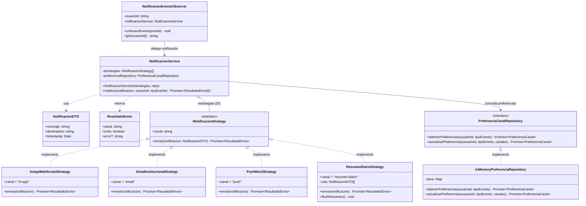

# Módulo de Notificaciones — Patrón Strategy

Este módulo implementa el **patrón Strategy** para el envío de notificaciones multicanal en UniConnect. Cada canal de entrega es una estrategia intercambiable; el `NotificacionService` (contexto) opera sobre la interfaz y nunca conoce las implementaciones concretas.

---

## Estructura de archivos

```
src/modules/notifications/
├── domain/
│   ├── INotificacionStrategy.ts      # Interfaz de estrategia + ResultadoEnvio
│   └── contracts.ts                  # PreferenciaCanal, PreferenciaCanalRepository
├── application/
│   └── NotificacionService.ts        # Contexto — recibe estrategias por DI
├── infrastructure/
│   ├── strategies/
│   │   ├── InAppWebSocketStrategy.ts
│   │   ├── EmailInstitucionalStrategy.ts
│   │   ├── PushMovilStrategy.ts
│   │   └── ResumenDiarioStrategy.ts  # Canal adicional (Open/Closed)
│   ├── InMemoryPreferenciaRepository.ts
│   └── NotificacionEventoObserver.ts # Puente con el Observer del Sprint 3
└── interfaces/http/
    ├── notificacion.controller.ts
    └── notificacion.routes.ts
```

---

## Diagrama UML



---

## Endpoints HTTP

| Método | Ruta | Descripción |
|--------|------|-------------|
| `GET` | `/api/notificaciones/preferencias/:tipoEvento` | Obtiene canales activos del usuario para un tipo de evento |
| `PUT` | `/api/notificaciones/preferencias/:tipoEvento` | Actualiza canales activos del usuario |
| `POST` | `/api/notificaciones/prueba` | Envía una notificación de prueba por los canales activos |

### Tipos de evento válidos
`academico` · `cultural` · `deportivo` · `otro`

### Canales disponibles
| Canal | Clase | Descripción |
|-------|-------|-------------|
| `in-app` | `InAppWebSocketStrategy` | Emite vía Socket.IO al usuario conectado |
| `email` | `EmailInstitucionalStrategy` | Envío de correo institucional |
| `push` | `PushMovilStrategy` | Notificación push al dispositivo móvil |
| `resumen-diario` | `ResumenDiarioStrategy` | Encola notificaciones para resumen periódico |

---

## Integración con el Observer (Sprint 3)

`NotificacionEventoObserver` implementa `IEventoObserver` y se registra en `EventoPublicador`. Cuando llega un evento de una categoría suscrita, el observer construye una `NotificacionDTO` y delega al `NotificacionService`, que filtra estrategias según las preferencias del usuario.

```
EventoPublicador.notificar()
    └── NotificacionEventoObserver.onNuevoEvento(evento)
            └── NotificacionService.notificar(dto, usuarioId, evento.categoria)
                    └── [InAppWebSocketStrategy | EmailInstitucionalStrategy | ...]
```

---

## Principio Open/Closed

Para agregar un nuevo canal (ej. `ResumenDiarioStrategy`):

1. Crear la clase que implemente `INotificacionStrategy`.
2. Registrarla en el array de estrategias en `container.ts`.
3. **No se modifica** `NotificacionService` ni ninguna estrategia existente.

---

## Tests

```bash
npx jest tests/notificacion-strategy.test.ts
```

Cubren: contrato de interfaz, ejecución por canal, inyección de dependencias, filtrado por preferencias, aislamiento de errores y extensibilidad OCP.
